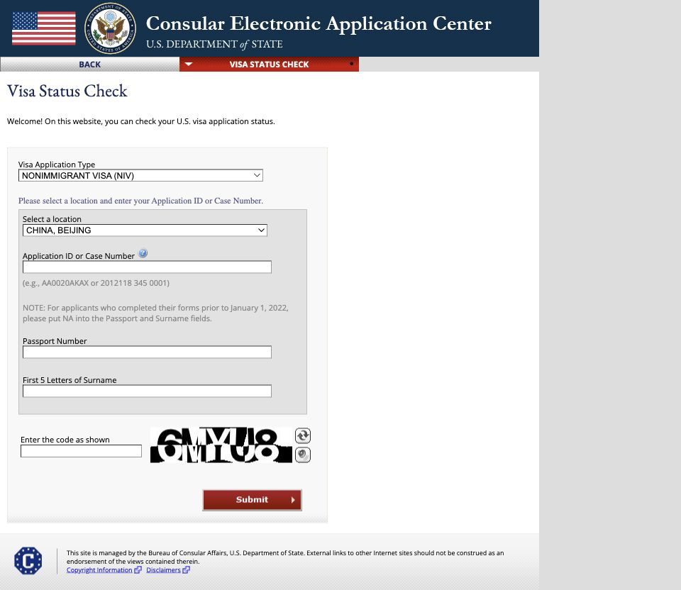
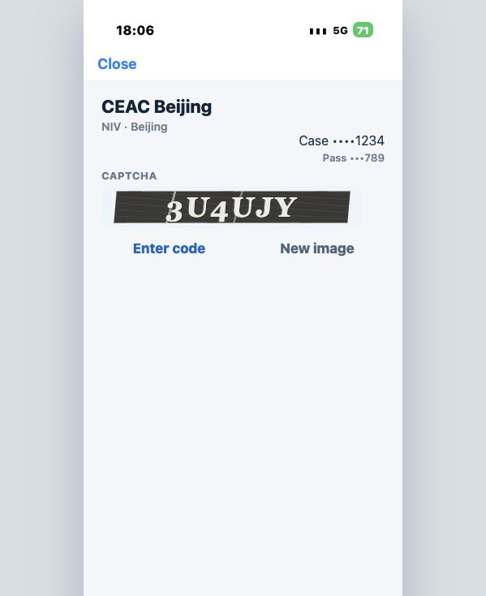

# CEAC Scriptable 查询工具

非官方 iPhone Scriptable 脚本，用于查询 CEAC NIV 签证状态。查询结果以 [CEAC 官网](https://ceac.state.gov/CEACStatTracker/Status.aspx) 为准。

## 截图

| CEAC 官网 | Scriptable 查询页 |
| --- | --- |
|  |  |

截图不包含真实个人信息。

## 它有什么用

- 保存中国查询地点、Application ID、护照号、姓氏，避免每次手动填写
- 在 Scriptable 里显示 CEAC 验证码图片
- 手动输入验证码后提交查询
- 小组件显示最近一次查询结果

## 和官网直接查询的区别

| 项目 | CEAC 官网 | 这个脚本 |
| --- | --- | --- |
| 固定信息 | 每次手动输入 | 保存在 Scriptable Keychain |
| 验证码 | 手动输入 | 手动输入 |
| 查询入口 | 浏览器 | Scriptable |
| 小组件 | 无 | 显示最近一次结果 |

## 使用方法

1. 在 App Store 安装 [Scriptable](https://apps.apple.com/app/scriptable/id1405459188)。
2. 打开 Scriptable，点击右上角 `+` 新建脚本。
3. 打开 [ceac-scriptable.js](ceac-scriptable.js)，点击 `Raw`，复制全部内容，粘贴到新脚本里。
4. 首次运行脚本，选择中国查询地点，再输入 Application ID、护照号、姓氏。
5. 之后运行脚本，输入页面显示的验证码并提交。
6. 需要更换地点、修改 profile 或清空保存的信息时，运行脚本后点 `Settings`。
7. 需要小组件时，在桌面添加 Scriptable 小组件，并选择这个脚本。

## 工作原理

1. 首次运行时，脚本把中国查询地点、Application ID、护照号、姓氏保存到 Scriptable Keychain。
2. 查询时，脚本请求 CEAC 状态页，保留 cookie 和 ASP.NET hidden fields。
3. 脚本进入 NIV / 所选中国地点的查询流程，加载同一会话里的验证码图片。
4. 用户手动输入验证码。
5. 脚本把保存的固定字段和验证码提交给 CEAC。
6. 脚本从 CEAC 返回的 HTML 里解析状态，并缓存最近一次结果给小组件读取。

脚本不识别验证码，不绕过验证码。

## 数据和脱敏

提交给 CEAC 的字段：

- Application ID / Case Number
- Location
- Passport Number
- Surname
- CAPTCHA

界面显示规则：

- Application ID / Case Number：只显示最后 4 位，例如 `Case ••••1234`
- Location：显示城市名，例如 `Beijing`
- Passport Number：只显示最后 3 位，例如 `Pass •••789`
- Surname：不显示

这些固定字段保存在 Scriptable Keychain，不写入脚本源码。查询请求会发送到 CEAC 官网。

目前内置的中国查询地点：Beijing、Chengdu、Guangzhou、Shanghai、Shenyang、Wuhan。

`Settings` 里的 `Reset profile` 会删除保存的地点、Application ID、护照号、姓氏和最近一次结果缓存。

## 限制

- 需要手动输入验证码
- 小组件不能输入验证码，只能显示最近一次查询结果并打开 Scriptable
- CEAC 页面结构变化后，脚本可能需要更新

## 文件

| 文件 | 说明 |
| --- | --- |
| [ceac-scriptable.js](ceac-scriptable.js) | 复制到 Scriptable 的主脚本 |
| [assets/ceac-official.png](assets/ceac-official.png) | CEAC 官网截图 |
| [assets/scriptable-query.png](assets/scriptable-query.png) | Scriptable 查询页截图 |
| [ceac-preview.html](ceac-preview.html) | 本地调试预览页 |

## 开源前检查

- 脚本里没有真实 Application ID、护照号、姓名
- README 图片不包含真实个人信息
- 不提交手机真实截图、日志、剪贴板缓存

## 免责声明

本项目不是美国国务院、CEAC 或任何签证服务机构的官方工具。
